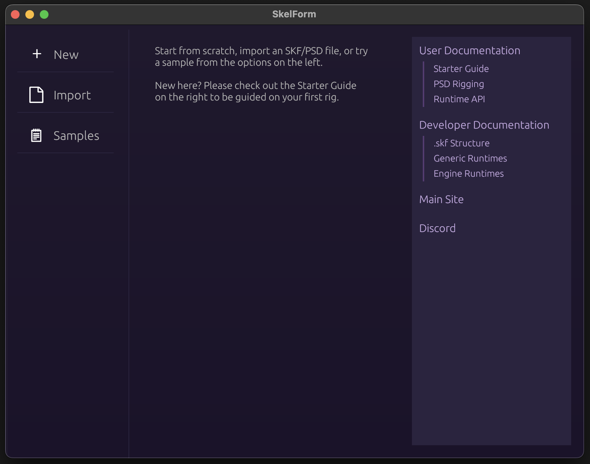

# Before You Download...

...check out the <a href="https://skelform.org/editor" target="_blank">Web
version</a> , which does not require downloading!

Otherwise, read on.

# Installation

The SkelForm editor can be downloaded from the [site](https://skelform.org).

It's only prvided as a portable program, and does not have an installer.

Once it's downloaded, unzip/uncompress the zip file and open the SkelForm binary
(SkelForm.exe on Windows).

If you see a screen like this, then all is good!

Let's get started and go through the [basics](./starter-guide/basics.md).
