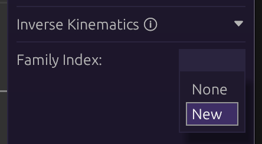

# Inverse Kinematics

Armatures with limbs (shoulders, legs, etc) can use inverse kinematics to
automatically adjust themselves, rather than needing manual treatment.

This can greatly speed up animation workflows, as limbs will only need a single
bone as a point of reference. It can also enable procedural/dynamic animations
in games.

_Note: For the rest of this section, inverse kinematics will be referred to as
IK._

## Table of Contents

- [Hierarchy Setup](#hierarchy-setup)
- [Families and Indexies](#families-and-indexes)
- [Target Bone](#target-bone)
- [Constraints](#constraints)

## Hierarchy Setup

Bones must be ordered such that each connecting joint will be the child of the
other. There can be as many children within a bone, but only one of them can be
connected via IK.

## Families and Indexes

Select any bone to be part of IK, and click `New` in the `Family Index` dropdown
in the **Bone** panel:

This will create a new family (group) of joints, along with other options.
Assign other bones to be part of the same family with the same index.

In the image below, bones with IK in their name are all set to the same family
index (0):

## Target Bone

IK families need a bone to 'target', which will be their point of reference.
Without it, they won't move.

1. Create a new bone
2. Select the first bone in an IK family
3. Click the target button next to `Target:`
4. Select the new bone

The family will now follow, or point to, the target bone.

## Constraints

By default, IK families will bend however they can to reach their target. This
can be undesirable for eg; shoulders or legs, which can only bend one way.

Clicking on the first bone of an IK family will show the `Constraint:` option:

The names come from the directions represented by the arrows. In practice it's
not required to know which to use in advance. Simply test both to find what's
appropriate.
