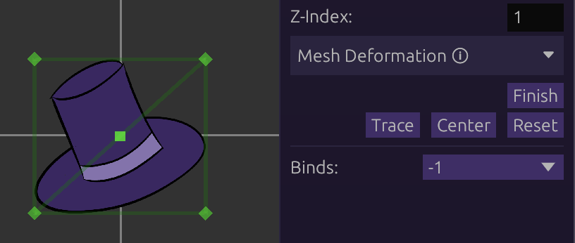
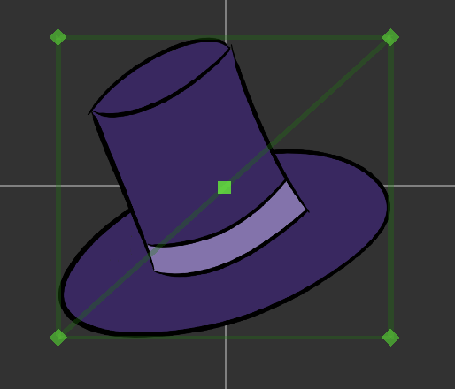
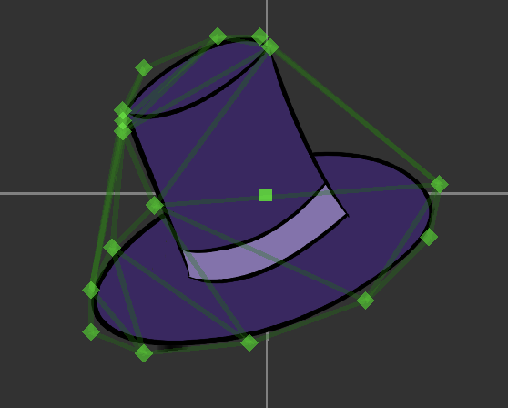
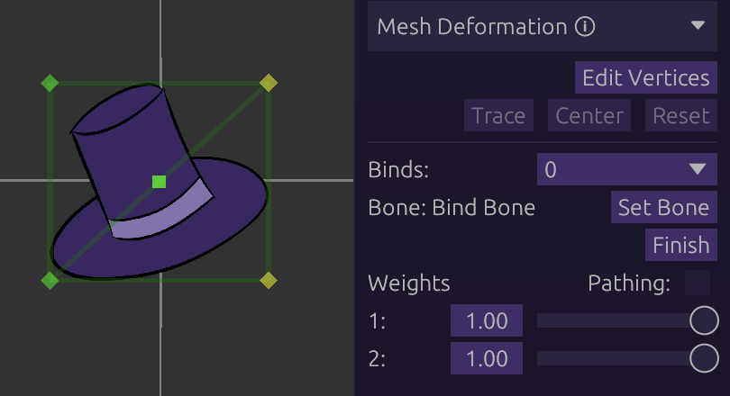
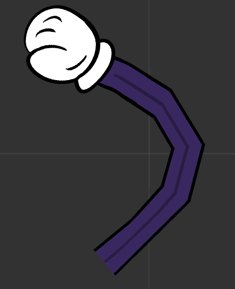
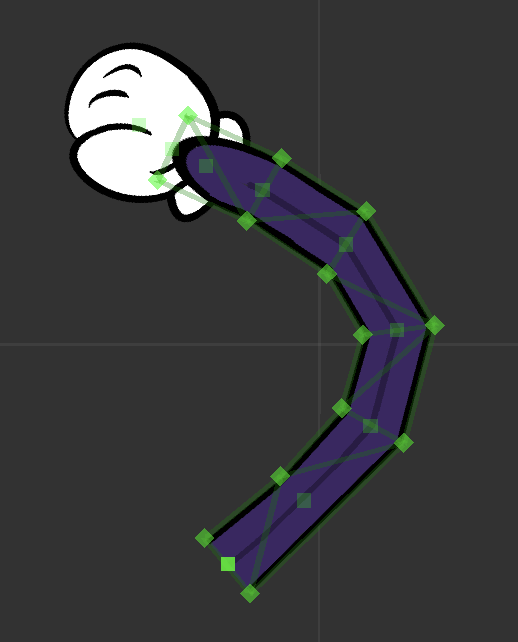

# Mesh Deformation

Textures can be turned into meshes that can be warped flexibly, using vertices
and binds.

## Table of Contents

- [Vertices](#vertices)
  - [Dragging Vertices](#dragging-vertices)
  - [Adding Vertices](#adding-vertices)
  - [Deleting Vertices/Triangles](#deleting-verticestriangles)
  - [Tracing](#tracing-texture)
- [Binds](#binds)
  - [Creating Binds](#creating-binds)
  - [Binding Vertices](#binding-vertices)
  - [Weights](#weights)
  - [Pathing](#pathing)

## Vertices

All textures start off with 4 vertices, forming its full rectangle.

Clicking 'Edit Vertices' will show the vertices and lines.

### Dragging Vertices

Vertices, as well as the lines and triangles formed by them, can be dragged
around to be moved.

Dragging a line or triangle will move the 2 or 3 vertices that it connects to,
respectively.

### Adding Vertices

While hovering anywhere on a mesh, left-clicking will create a vertex in that
place.

This will reconstruct the triangles to form the mesh with the new vertex.

### Deleting Vertices/Triangles

Right clicking on a vertex will delete it, and reconstruct the triangles.

A triangle can also be deleted with a right-click. This will not delete any
vertices, _only_ the triangle. This can be used to remove excess triangles in
cases of over-zealous triangle construction.

### Tracing

While editing vertices, clicking `Trace` will automatically generate a cutout of
vertices around the texture.

<figure>
  
  
  <figcaption>Default, quad vertices (left) vs. traced vertices (right)</figcaption>
</figure>

This often requires cleanup of the vertices.

**Note:** tracing is not intended to work on textures with 'holes' in them.

## Binds

Vertices can be bound to other bones to be followed around and inherit their
properties (scale, rotation, etc).

This is the only way to animate vertices individually, as they cannot be
recorded on their own.

### Creating Binds

Clicking `[New]` in the binds dropdown will create a new bind.

Click `Set Bone` and the bone in question to be set as the bind.

The option to `Bind Verts` will finally appear.

### Binding Vertices

As with `Edit Vertices`, clicking `Bind Verts` will show the vertices.

Clicking on a vertex will bind it, indicated by its yellow color. Clicking a
bound vertex will unbind it and go back to green.

When bound, vertices will follow the bone around based on its weight scale and
pathing behavior (if enabled).

### Weights

Each vertex in a bind has a 'weight' scale, ranging from 0 to 1. This determines
how strongly the vertex is inheriting the bone.

**Example**: A weight of 0.5 will cause the vertex in question to inherit only
'half' the amount of its bone.

### Pathing

Enabled by ticking the `Pathing` checkbox.

Instead of inheriting the bone directly, vertices can be set to follow along an
imaginary path formed by its bind(s).

Under pathing, weights will determine how far away the vertex is from the bind.
`0` will snap the vertex directly on the bind.

Use cases:

- Tube-like or pipe-like structures
- Rubberhose-style limbs (see **Skellington** sample in-editor)

<figure>
  
  
  <figcaption>A rubberhose limb (left) and its vertices (right). Notice the bind bones (translucent squares) between vertex pairs</figcaption>
</figure>
