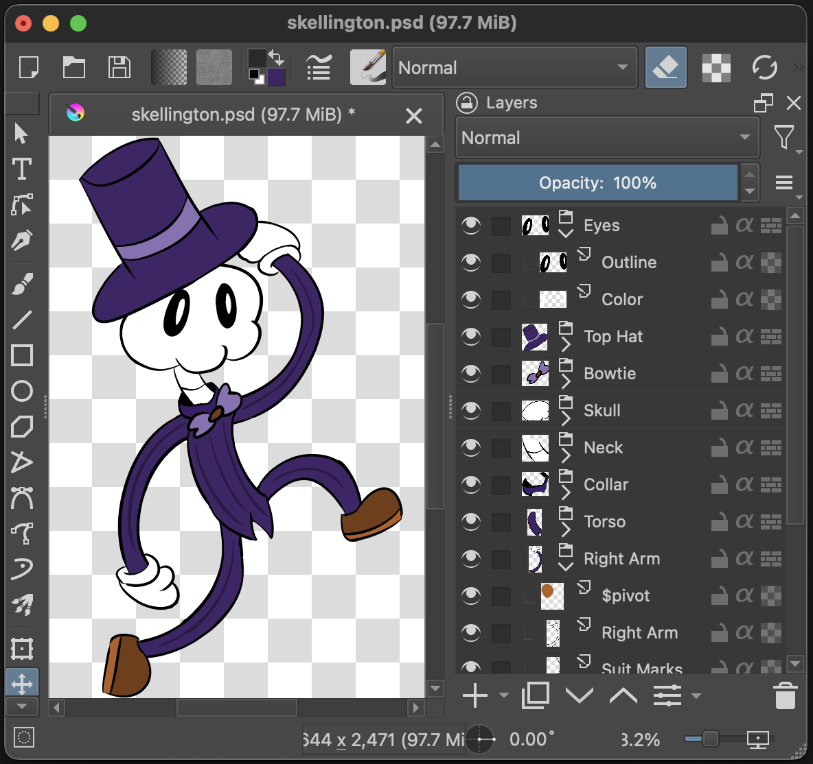
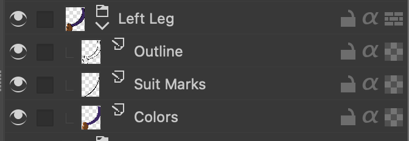
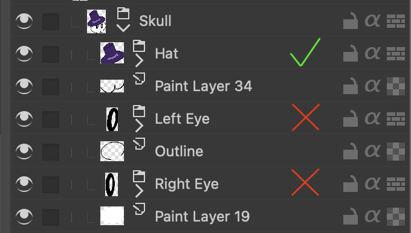
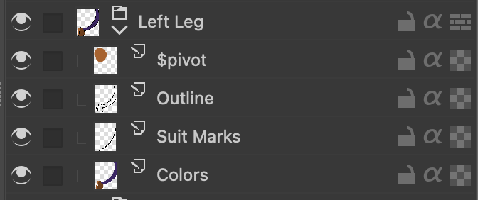
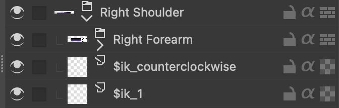

# PSD Rigging

SkelForm supports importing Photoshop Document (PSD) files to turn into an
armature. To do this, a specific structure is needed.

## Table of Contents

- [Sample File](#sample-file)
- [Group > Bone, Layer(s) > Texture](#group--bone-layers--texture)
- [Child Bones](#child-bones)
- [Pivots](#pivots)
- [Inverse Kinematics](#inverse-kinematics)

## Sample File

A sample PSD file may be
[downloaded](https://github.com/Retropaint/SkelForm/blob/master/samples/skellington.psd?raw=true)
to be kept as a reference, and will automatically form a proper rig when
imported in SkelForm.

## Group > Bone, Layer(s) > Texture

Bones are made out of groups, and all layers of a group will be merged to form
it's texture:

## Child Bones

Groups in groups will be children, however they must be first in the hierarchy.
Groups after a layer will be ignored.

## Pivots

By default, bones created from groups will not have a dedicated pivot parent,
and will be centered.

To add a dedicated pivot, create a layer specifically named
<strong>$pivot</strong>, and make it a child of the group in question. The
pivot's position will be based on the top-left corner of the layer:

Although this layer will be invisible in the rig, you may need to draw on it to
be able to position it in your art program.

When importing the PSD, that group should now be comprised of 2 bones: the main
bone (pivot), and the texture. From here on out, it is recommended to only edit
the main bone.

## Inverse Kinematics

_See: [Inverse Kinematics](./inverse-kinematics.md)_

Layers starting with `$ik_` will be used to set IK properties to their
respective bones.

Family id format: `$ik_X`

Examples:

- 
<code>$ik_0</code>

- 
<code>$ik_1</code>

Constraints:

- 
<code>$ik_clockwise</code>

- 
<code>$ik_counterclockwise</code>

Once imported, a target bone will be automatically generated and assigned.
