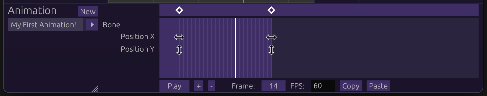

# Animating

In the [previous](./basics.md) section, we went over the basics with bones and
how they work.

Right now, they're static and boring. Let's change that!

## Table of Contents

- [Opening Animation Editor](#opening-animation-editor)
- [Adding Keyframes](#adding-keyframes)
- [Playing The Animation](#playing-the-animation)
- [Editing Keyframes](#editing-keyframes)

## Opening Animation Editor

On the top right, you will see <strong>Armature</strong> and
<strong>Animation</strong>. Click the latter, and a panel at the bottom of the
screen will appear.

To the left of it, click <strong>New</strong> to create a new animation. You
will be prompted to name it first, though you can press Enter to leave it with
the default name.

The animation editor should appear:

Let's get to animating!

## Adding Keyframes

Click on a line anywhere in the animation editor. Edit the bone in any way
(moving, scaling, etc), and you should see it appear in the animation editor:

This means that your edit has been recorded!

You will notice that in addition to the keyframe that you clicked, there is one
at the very left. This is the initial value of the field that you edited, so the
animation knows how to interpolate the field.

Speaking of interpolation...

## Playing The Animation

Let's play the animation, either by pressing the spacebar or clicking the
<strong>Play</strong> button at the bottom of the animation editor.

You should see your bone being animated! This will keep running in a loop until
you stop it (spacebar or <strong>Stop</strong> button).

## Editing Keyframes

Keyframes can be individually edited, and the individual fields can even be
dragged around. Try dragging either the diamonds at the top of the keyframe
editor, or the icons that correspond to their field. The animation will be
changed to reflect their places in the timeline.

Clicking a diamond will also 'select' the keyframe. The right panel will show
extra information about the selected keyframe, along with some options. Play
around with them and see how the animation changes!

## Conclusion

The animation process is hopefully simple to grasp, as it is essentially
recording edits and adjusting keyframes. Realistically however, an animation
will contain lots of them. Try to make an expressive animation while keeping the
keyframes organized!

[That's all, folks!](./finale.md)
