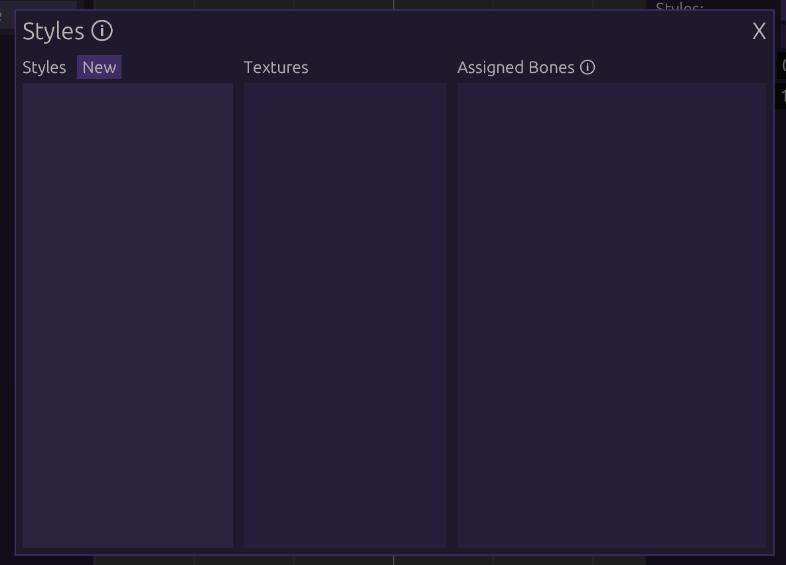
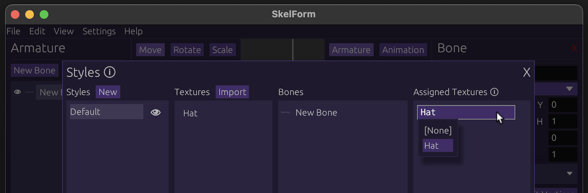
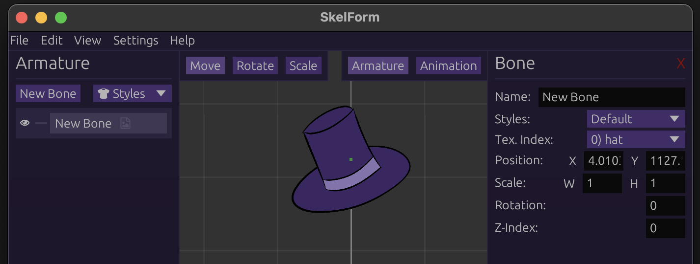
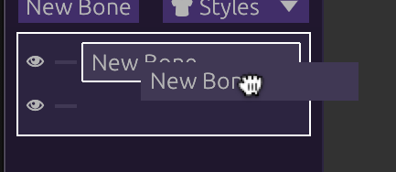

# Basics

For the basics, we will go through a simple rigging process, as well as a little
tour around the editor.

## Table of Contents

- [Moving & Zooming the Camera](#moving--zooming-the-camera)
- [Your First Bone](#your-first-bone)
- [Adding a Texture (and Style)](#adding-a-texture-and-style)
- [Parent & Child Bones](#parent--child-bones)
  - [Parent-Child Bone Inheritance](#parent-child-bone-inheritance)
  - [Pivots & Hinges](#pivots--hinges)

## Moving & Zooming the Camera

Hold Ctrl/CMD while dragging the mouse to move the camera.

Zoom in/out with the scroll wheel or -/+ keys. On a touchpad, drag 2 fingers
up/down.

## Your First Bone

Click the <strong>New Bone</strong> button on the <strong>Armature</strong>
panel (left side) to create a bone.

The <strong>Bone</strong> panel (right side) will show the bone's fields such as
position, scale, etc., and can be edited.

The bone can be edited by dragging the mouse while holding left-click. The field
being edited is based on the top-left bar's selection (<strong>Move</strong>,
<strong>Scale</strong>, <strong>Rotate</strong>).

## Adding a Texture (and Style)

The bone is invisible right now, and all you see is the green point that
represents it's center.

To give this bone a texture we'll need a Style, which is a group of textures.
Multiple can be made for outfits and skins, but we'll just use one for now.

To add a Style, click on the `Styles` dropdown next to `New Bone`, or in the
bone panel. Click `[Setup]` within to open up the Styles modal:

From here, click on `New Style` and give it a name. Click `Import` next to
Texture when it appears, and select any image to be used.

After importing the image, the Assigned Bones section will show all bones and
what texture they're using (based on name). Since your bone isn't using any,
click on it (or drag the texture to it) to assign it:

Close the Styles modal, and you should now see your bone with the given texture.

## Parent & Child Bones

Bones can be children or parents of one another. This affects how they are
transformed, which will be useful for joints and such.

**Example:**

- shoulder -> forearm -> wrist
- neck -> head

Create another bone, give it a texture (as in the
[above step](#adding-a-texture-and-style)), then drag either bone to the other:

Once released, the bone you held will be the child of the other!

Changing the parent in any way will affect the child as well. If both bones are
textured, this is easy to see. Play with the parent to see how the child
behaves!

### Parent-Child Bone Inheritance

Child bones always inherit their parent's properties.

**Example**:

- Child position = (2, 2)
- Parent position = (3, 3)
- Final child position = child + parent = (5, 5)

For scale, the field is multiplied by the parent.

**Note**: The bone panel shows the bone's own field values. A child's position
in (0, 0) means it's in the center of the parent, _not_ necessarily the grid.

### Pivots & Hinges

Child bones will 'orbit' their parent when the parent is rotated. This can be
used to set parents as the 'pivot' to their children.

**Example**: A foot is the child of the knee. When the knee rotates, the foot
'orbits' and correctly stays in place.

Often you may need to create an invisible bone to act as the pivot of another,
textured one.

## Conclusion

Play around with bones and textures, and try to create a rig.

Once you are ready, let's start [animating](./animating.md) it!
