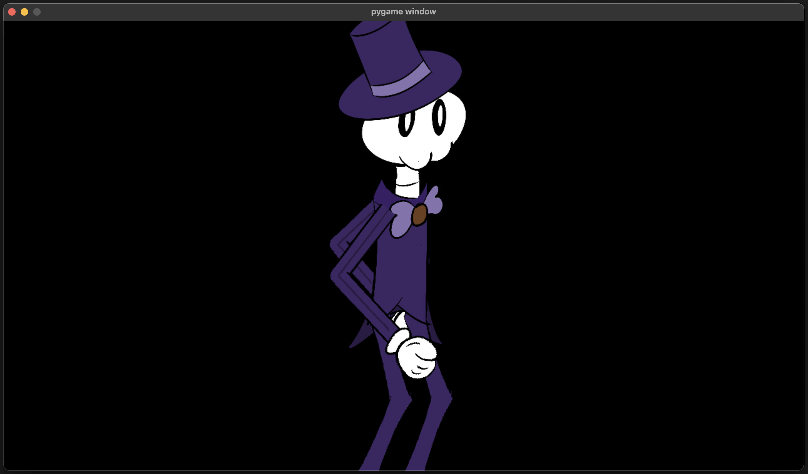

# Using In a Game

For this section we'll use [pygame](https://www.pygame.org/wiki/GettingStarted),
but any of the [supported engines](https://skelform.org#runtimes) will do
provided you understand the language and basics.

_This section assumes you have a basic understanding of using the command prompt
and/or terminal. Engines with a graphical editor are not supported at the time
of writing._

## Table of Contents

- [Setup](#setup)
- [Loading the Armature](#loading-the-armature)
- [Animating & Drawing](#animating--drawing)
- [Full Setup](#full-setup)

## Setup

_Note: this is not comprehensive of all steps. Please read the provided links
thoroughly._

1. Ensure you have [Python](https://python.org) installed and running
2. Make a folder (something like `skf_game`)
3. Create and enter a
   [virtual environment](https://www.w3schools.com/python/python_virtualenv.asp)
4. Install dependencies:

```bash
pip install pygame-ce
pip install skelform_pygame
pip install dacite
```

5. Create a Python file (perhaps `game.py`) and paste this into it:

```python
import pygame
import skelform_pygame

pygame.init()

screen = pygame.display.set_mode((1280,720))

clock = pygame.time.Clock()
time = 0

#1 - load armature

while True:
    for event in pygame.event.get():
        if event.type == pygame.QUIT:
            pygame.quit()
            raise SystemExit
    screen.fill("black")

    #2 - get frame

    #3 - animate

    #4 - draw

    pygame.display.flip()
    clock.tick(120)
    time += clock.get_time() / 1000
```

_Courtesy of https://www.pygame.org/docs/tut/newbieguide.html_

Run the file with `python game.py` (or `python3`). If you see a black window
with `pygame window` at the top, then you're all set!


Lines that look like `#1 - load armature` will be used to guide you along the
way.

## Loading the Armature

We'll need to load the armature to use it. `skelform_pygame` provides a handy
`load()` function for that!

Underneath `#1`, paste this:

```python
file_name = "skellington.skf"
(skf_root, textureAtlas) = skelform_pygame.load(file_name)
```

Edit `file_name` to be the name of the .skf file that you exported.

## Animating & Drawing

With the loaded armature, we can use it as much as we'd like. In fact, let's use
it now!

Before we can animate it, we must get an approriate frame. We'll use `time` in
our code to get a frame based on the time.

Underneath `#2`, paste this:

```python
frame = skelform_pygame.time_frame(
    time,
    skf_root.armature.animations[0],
    False,
    True
)
```

This will give us an appropriate frame that we can use for the first animation.
Note that we have enabled looping since the last paramter is `True`. The one
before it is reversing, which we don't need.

Now we can process the armature for our first animation.

Underneath `#3`, paste this:

```python
drawn_bones = skelform_pygame.animate(
    skf_root.armature,
    [skf_root.armature.animations[0]],
    [frame],
    screen,
    skelform_pygame.AnimOptions(
        pygame.Vector2(screen.width/2, screen.height/2)
    ),
)
```

This will process the first animation at the specified frame, with the armature
being positioned at the center of the screen. We're also given a new set of
bones, which will be drawn on-screen.

Underneath `#4`, paste this:

```python
skelform_pygame.draw(drawn_bones, skf_root.armature.styles, textureAtlas, screen)
```

This will draw the bones on screen. Finally!

Let's see it in action. Run the file, and you should see your armature being
animated!



...and that's it!

The armature's position and scale can be controlled from `AnimOptions` in
`animate()`, so you can use eg; `position` to move it around. Try making it move
when pressing the left or right arrow keys!

## Full Setup

This the final code with the above steps included:

```python
import pygame
import skelform_pygame

pygame.init()

screen = pygame.display.set_mode((1280,720))

clock = pygame.time.Clock()
time = 0

#1 - load armature
file_name = "skellington.skf"
(skf_root, textureAtlas) = skelform_pygame.load(file_name)

while True:
    for event in pygame.event.get():
        if event.type == pygame.QUIT:
            pygame.quit()
            raise SystemExit
    screen.fill("black")

    #2 - get frame
    frame = skelform_pygame.time_frame(
        time,
        skf_root.armature.animations[0],
        False,
        True
    )

    #3 - animate
    drawn_bones = skelform_pygame.animate(
        skf_root.armature,
        textureAtlas,
        [skf_root.armature.animations[0]],
        [frame],
        screen,
        skelform_pygame.AnimOptions(
            pygame.Vector2(screen.width/2, screen.height/2)
        ),
    )

    #4 - draw
    skelform_pygame.draw(drawn_bones, skf_root.armature.styles, textureAtlas, screen)

    pygame.display.flip()
    clock.tick(120)
    time += clock.get_time() / 1000
```
