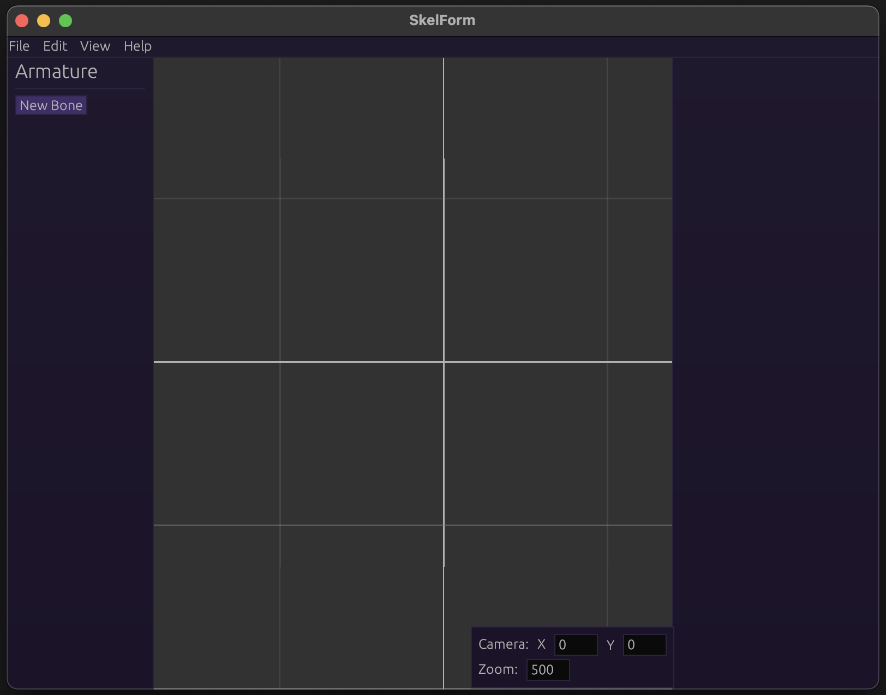

# Before You Download...

...check out the
<a href="https://retropaint.github.io/skelform_web/" target="_blank">Web
version</a> , which does not require downloading!

Otherwise, read on.

# Installation

The SkelForm editor can be download from the main site's Download page.

It is only prvided as a portable program, and does not have an installer.

Once it is downloaded, unzip/uncompress the zip file and open the SkelForm
binary (SkelForm.exe on Windows).

If you see a screen like this, then all is good!

Let's get started and go through the [basics](./basics.md).
